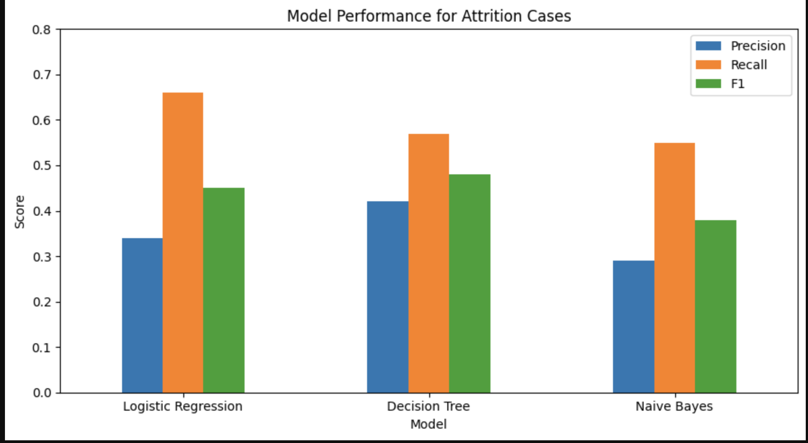
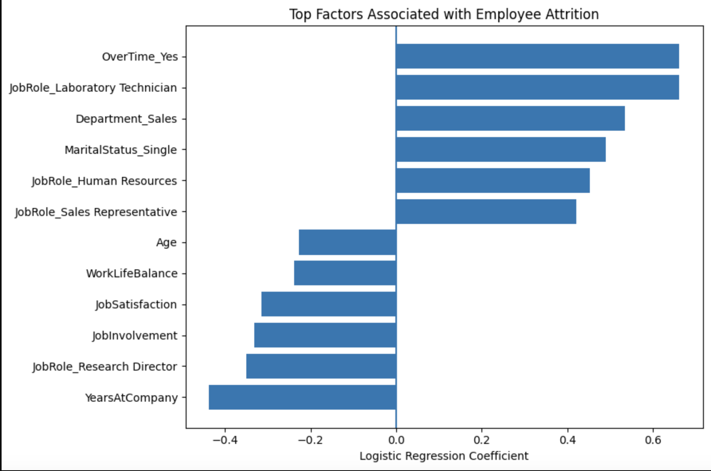

# Employee Attrition Analysis & Prediction

End-to-end HR analytics project using SQL, Power BI and Python to analyse employee attrition patterns, compare classification models, and translate findings into practical HR actions.

## Project Overview

Employee attrition is rarely explained by one factor alone. Employees may leave because of workload, career progression, job satisfaction, manager quality, external opportunities, personal circumstances, or a combination of these factors.

This project uses the IBM HR Analytics Employee Attrition dataset to explore whether structured HR data can be used to:

1. identify where attrition is concentrated,
2. examine which employee characteristics are associated with attrition,
3. build a simple classification model to identify higher-risk employee profiles,
4. translate those findings into practical HR retention actions.

The project combines:

- SQL for data validation, cleaning and exploratory analysis,
- Power BI for visualising attrition patterns,
- Python for predictive modelling and model comparison.

The purpose of the model is not to predict with certainty who will resign. Instead, it is designed as a decision-support tool that can help HR identify areas where further investigation or intervention may be useful.

---

## The Gap I Wanted to Explore

The project was motivated by research showing that employee turnover is influenced by a broad combination of organisational, HR, employee and environmental factors.

Mishra and Mishra (2013) highlight that attrition and retention are influenced by factors such as organisational commitment, job satisfaction, HR practices, employee characteristics, workplace support and external opportunities. Their review shows that turnover is a multidimensional issue rather than something that can be understood through one variable alone.

This led to the question behind the project:

> Can structured HR data be used not only to describe attrition, but also to combine multiple employee characteristics into a simple risk-identification approach that HR could act on?

The project therefore attempts to bridge the gap between descriptive HR reporting and practical decision support.

Fallucchi et al. (2020) also demonstrated that machine-learning techniques can be applied to the same IBM HR dataset to identify patterns associated with attrition and support HR decision-making.

---

## Dataset

The project uses the IBM HR Analytics Employee Attrition & Performance dataset.

The original dataset contains:

- 1,470 employees
- 35 variables
- 237 employees who left
- 1,233 employees who stayed
- overall attrition rate of 16.1%

The variables include demographic, job, experience and employee-experience measures such as:

- Age
- Monthly Income
- Department
- Job Role
- Distance From Home
- Job Satisfaction
- Job Involvement
- Work-Life Balance
- Overtime
- Total Working Years
- Years At Company
- Years Since Last Promotion

---

## What I Did

### 1. Validated and Cleaned the Data in SQL

I began by checking the structure and quality of the dataset before carrying out any analysis.

The validation included:

- checking the total number of employees,
- checking the number of variables,
- identifying duplicate employee IDs,
- checking for missing values,
- checking for constant fields that added no analytical value.

Three variables were found to contain the same value for every employee:

- `EmployeeCount`
- `Over18`
- `StandardHours`

These were not useful for analysis.

I then created a cleaner analysis table and engineered practical HR categories such as:

- Age Band
- Income Band
- Tenure Band
- Distance Band
- Promotion Wait Band
- Attrition Flag

The cleaned dataset was then used across both Power BI and Python.

---

### 2. Explored Attrition Patterns in Power BI

The next stage focused on understanding where attrition was concentrated across the workforce.

Overall attrition was:

- 237 employees left
- 1,233 employees stayed
- 16.1% overall attrition rate

Some of the clearest patterns were:

- employees working overtime had an attrition rate of approximately 30.5%, compared with 10.4% for employees not working overtime,
- employees under 25 had the highest age-group attrition rate at approximately 39.2%,
- employees earning under 3,000 had an attrition rate of approximately 28.6%,
- employees with low job involvement had attrition of approximately 33.7%, compared with 9.0% among those with very high involvement,
- employees with the poorest work-life balance had attrition of approximately 31.3%,
- employees living 21+ units from work had attrition of approximately 22.1%,
- shorter organisational tenure was associated with substantially higher attrition,
- Sales had higher attrition than Research & Development.

The Power BI report was divided into two pages:

- Attrition Overview
- Attrition Drivers

This allowed the analysis to separate overall workforce patterns from employee-experience factors.

---

## Dashboard

### Attrition Overview


### Attrition Drivers


The full Power BI report is also available in the `dashboard` folder.

---

### 3. Built Predictive Models in Python

After the descriptive analysis, I tested whether a combination of employee characteristics could help identify employees belonging to the attrition group.

The following predictors were selected:

- Age
- Monthly Income
- Distance From Home
- Job Involvement
- Job Satisfaction
- Work-Life Balance
- Total Working Years
- Years At Company
- Years Since Last Promotion
- Overtime
- Department
- Job Role
- Marital Status

Categorical variables were converted into model-readable binary variables using one-hot encoding.

The data was then split into:

- 80% training data
- 20% test data

A stratified split was used so that the proportion of employees who left remained similar in both datasets.

---

### 4. Compared Three Classification Models

Three models were compared:

1. Logistic Regression
2. Decision Tree
3. Gaussian Naive Bayes

The results were:

| Model | Accuracy | Precision - Attrition | Recall - Attrition | F1 |
|---|---:|---:|---:|---:|
| Logistic Regression | 74.1% | 34% | **66%** | 45% |
| Decision Tree | **80.3%** | **42%** | 57% | **48%** |
| Naive Bayes | 71.1% | 29% | 55% | 38% |

The Decision Tree achieved the highest overall accuracy.

However, Logistic Regression achieved the highest recall for employees who actually left.

There were 47 actual leavers in the test set, and Logistic Regression correctly identified 31 of them.

This resulted in a recall of approximately 66%.

For this HR use case, I prioritised recall because missing a potentially at-risk employee may be more costly than flagging an employee who later stays.

This choice involves a trade-off: higher recall also creates more false positives.

Fallucchi et al. (2020) similarly emphasised recall when evaluating employee attrition models because recall reflects the model's ability to identify actual attrition cases.

---

## Model Performance



---

## How I Interpreted the Findings

The Logistic Regression model broadly supported several patterns visible in the Power BI analysis.

Higher predicted attrition risk was associated with factors such as:

- overtime,
- greater distance from home,
- some job roles and departments,
- being single,
- longer time since promotion.

Lower predicted attrition risk was associated with:

- longer organisational tenure,
- greater job involvement,
- higher job satisfaction,
- better work-life balance,
- older age,
- greater total work experience.

These relationships should be interpreted as associations rather than causes.

For example, the model does not prove that overtime causes resignation. It shows that overtime was associated with a greater likelihood of belonging to the attrition group after the other variables in the model were considered.

Mishra and Mishra (2013) similarly describe employee retention as being influenced by a combination of organisational commitment, HR practices, workplace support, employee characteristics and environmental factors.

Pallathadka et al. (2021) also identify factors such as workload, lack of recognition, limited career progression, poor trust, unfair treatment and lack of development opportunities as possible contributors to attrition.

Manager quality may also explain part of the attrition picture that this dataset cannot directly measure. Hoffman and Tadelis (2020) found that stronger people-management skills were associated with lower employee turnover, particularly turnover that organisations would prefer to avoid.

Turnover may also occur for reasons that structured HR data cannot capture.

Mitchell, Holtom, and Lee (2001) argue that employees may leave following a sudden "shock", such as:

- an unexpected job offer,
- conflict with a manager,
- being passed over for promotion,
- relocation,
- organisational change,
- personal circumstances.

They also describe job embeddedness as an important retention concept.

Job embeddedness refers to how strongly connected someone is to their job through:

- links - their relationships and connections,
- fit - how well the job and organisation suit them,
- sacrifice - what they would give up by leaving.

These factors are not directly measured in the IBM dataset.

This means that the predictive model can identify patterns of higher risk, but it cannot explain every individual resignation.

---

## Logistic Regression Factors



The coefficients show which variables were associated with higher or lower predicted attrition within the model.

They should not be interpreted as causal effects.

Categorical coefficients are also interpreted relative to the category that was omitted during one-hot encoding.

---

## What This Means for HR

The practical value of attrition analytics is not simply generating a risk score.

The goal should be to use the analysis to identify where HR should investigate, ask questions and intervene.

### 1. Monitor Overtime and Workload

Overtime was one of the strongest patterns identified in both the descriptive analysis and the predictive model.

HR could monitor sustained overtime at team or department level and investigate:

- workload distribution,
- staffing levels,
- manager expectations,
- role design,
- capacity issues.

This would allow HR to investigate workload problems before they result in avoidable turnover.

Pallathadka et al. (2021) similarly identify work pressure and excessive workload as potential contributors to attrition.

---

### 2. Focus on Early-Tenure Employees

The dashboard showed considerably higher attrition among employees with shorter organisational tenure.

This suggests that the early employee lifecycle may be an important intervention point.

HR could introduce structured:

- 30-day check-ins,
- 60-day check-ins,
- 90-day check-ins,
- six-month stay conversations.

These conversations could explore:

- role clarity,
- onboarding experience,
- manager relationship,
- workload,
- job fit,
- support required.

---

### 3. Use Stay Interviews Before Exit Interviews

Exit interviews provide information after the decision to leave has already been made.

For groups showing multiple attrition-risk indicators, HR could instead use stay interviews to understand what is influencing employees while there is still an opportunity to respond.

Questions could focus on:

- workload,
- career opportunities,
- manager support,
- recognition,
- job satisfaction,
- role fit,
- intention to stay.

This is particularly useful because turnover may be influenced by factors that do not appear in structured HR datasets.

Mitchell et al. (2001) show that unexpected events or shocks can influence resignation decisions, meaning numerical employee records alone will not capture every risk.

---

### 4. Strengthen Manager Capability

Manager behaviour was not directly measured in this dataset.

However, Hoffman and Tadelis (2020) found that stronger people-management skills were associated with lower employee turnover.

Future HR analytics could therefore include manager-level measures such as:

- employee feedback,
- coaching quality,
- communication quality,
- manager support,
- team engagement,
- turnover by manager.

This could help identify whether attrition patterns are concentrated within particular teams or leadership environments.

---

### 5. Support Career Development and Recognition

The analysis showed patterns involving job involvement, job satisfaction, tenure and promotion history.

This suggests that retention should not be treated purely as a compensation problem.

HR could strengthen:

- career-development conversations,
- internal mobility,
- individual development plans,
- recognition programmes,
- transparent progression pathways,
- learning opportunities.

Pallathadka et al. (2021) similarly identify lack of recognition and limited opportunities for growth as relevant attrition factors.

---

### 6. Combine Quantitative and Qualitative Evidence

Predictive analytics can help answer:

> Where should HR look?

It cannot always answer:

> Why is this employee considering leaving?

A stronger retention approach would combine employee data with:

- employee pulse surveys,
- stay interviews,
- manager feedback,
- exit interviews,
- delayed exit interviews,
- open-text employee comments,
- career-development conversations.

The model should therefore be used as a supporting signal rather than an automated decision system.

Employees should not be labelled as "likely quitters" or treated differently based only on a model prediction.

Instead, the analysis can help HR prioritise supportive conversations and identify wider workforce patterns.

---

## Limitations

This project has several important limitations.

- The dataset is a public IBM HR Analytics dataset and may not reflect the workforce structure of a specific organisation.
- The analysis identifies associations, not causal relationships.
- Attrition represents only around 16% of the dataset, creating a class imbalance.
- Important variables such as manager quality, employee sentiment, external job opportunities and qualitative exit reasons are not directly measured.
- Sudden personal or organisational events influencing resignation cannot be captured using the available variables.
- The model was developed as a learning and decision-support exercise, not as a production-level HR prediction system.
- Any real-world use of employee-risk models would require careful consideration of fairness, privacy, transparency and human review.

---

## Tools Used

- MySQL
- Power BI
- Python
- Pandas
- Scikit-learn
- Matplotlib
- Google Colab
- GitHub

---

## Repository Structure

```text
Employee-attrition-analysis/
│
├── data/
│   └── employee_attrition_cleaned.csv
│
├── sql/
│   └── attrition_analysis.sql
│
├── python/
│   └── attrition_prediction.ipynb
│
├── dashboard/
│   ├── employee_attrition_dashboard.pbix
│   ├── Attrition overview.png
│   └── Attrition Drivers.png
│
├── images/
│   ├── model_comparison.png
│   └── logistic_regression_factors.png
│
└── README.md
